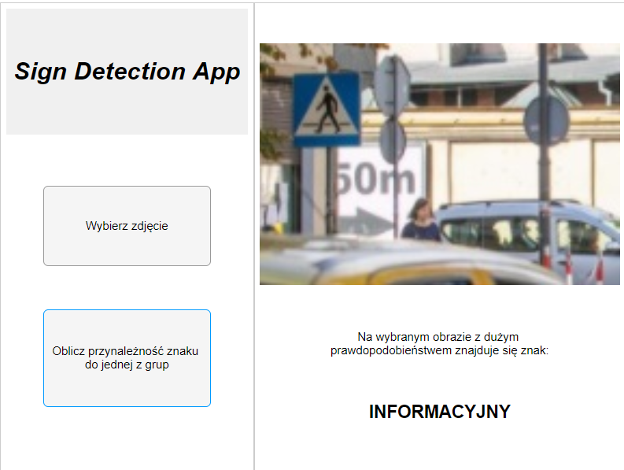

# Sign Detection App
  

  
## Project idea 
  
App allowing the user to detect four types of road signs on a photo provided by the user: identification, directional, informational, and regulatory. Created for a university course called "Image Analysis". The app was written 100% in Matlab. The project documentation was written in Polish due to the course restrictions.
  
## Starting the app
  
  1. In the MATLAB command window insert the command `'addpath images'` or add the App/images path to MATLAB paths, to load the logo.jpg file into the app (optional)
  2. Start the 'app1.mlapp' file, to start the Matlab App Designer
  3. Start the App by pressing the 'Run' button
  
## Skills gained during project
  
  -> Knowledge of image preprocessing such as:  
        Binarization  
        Image filters (Gaussian etc.)  
        Noise reduction  
        Operations such as closing, opening etc.  
  -> Usage of neural networks (feedforwardnet)  
  -> What are geometry coefficients  
  -> Creating an algorithm to single out road signs using image preprocessing and geometry coefficients  
  -> Creating a proper markdown file

## Team
  
The project was made in a team consisting of:  
  
  [Piotr Matiaszewski](https://github.com/BurningCodePieces/)  
  [Jakub Perlak](https://github.com/MrrrrFox/)  
  [Bartosz Mikołajczyk](https://github.com/mikolajczykb/)  
